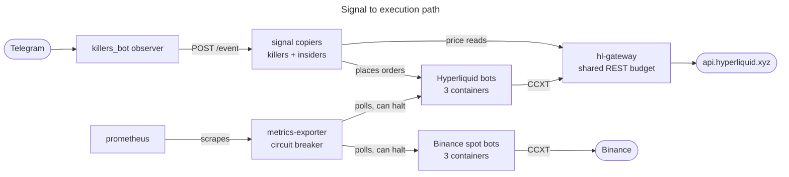

# Master Trader — Multi-Bot Algorithmic Trading System

A multi-strategy crypto trading system built on [Freqtrade](https://www.freqtrade.io/). The September 11 production review found three live bots and three dry-run bots, with health monitoring and consolidated portfolio analytics. Current revisions are still collecting evidence; reachability alone does not establish execution readiness or profitability.

Current production fleet:

| Venue | Bots | Observed mode |
|---|---|---|
| Binance spot | FundingFadeV1, KeltnerBounceV1 | Live; shared wallet |
| Hyperliquid futures | KillersScalpV1 | Live; native stop-limit orders verified |
| Binance spot | OITrendPullbackV1 | Dry-run |
| Hyperliquid futures | InsidersScalpV2, ShortKeltnerV2HLlive | Dry-run |

The [September 11 paper and fleet review](docs/audits/2026-09-11-order-flow-and-fleet-review.md)
records execution faults, local remediation, unresolved accounting issues,
and the proposed order-flow research protocol. Consult runtime configuration
for current modes; local fixes described in that review are not yet deployed.

The current authorization, known limitations, remediation status, and next
review are recorded in
[the 2026-08-24 live-fleet audit](docs/audits/2026-08-24-live-fleet-review-remediation.md).

## Architecture

Production stack, `ft_userdata/docker-compose.prod.yml`, 13 services:



Arrows show request initiation, not data flow. `metrics-exporter` and `prometheus` both poll, so on
those edges the data travels the other way.

The diagram covers the signal-to-execution path only. Left out for legibility: `funding-refresh`,
which writes Binance funding rates into the shared `ft_user_data` volume that all six bots and the
dashboard mount; `ft-dashboard`, which reads four read-only state volumes rather than Prometheus; and
per-service ports. `ft_userdata/docker-compose.prod.yml` holds all 13 services, and every published
port binds to `127.0.0.1`.

`metrics-exporter` takes its bot list from `ft_userdata/bots_config.json`
(`ft_userdata/metrics_exporter.py:36`), polls each bot's Freqtrade REST API on `:8080` (`:271`,
`:477`), and halts entries when the portfolio circuit breaker trips by posting `/stopentry` (`:485`).
That config file is the source of truth for which strategies are active and which wallet each one
draws on, so check it rather than this diagram if the two ever disagree.

`killers_bot` is not in this stack. It runs from `killers_bot/docker-compose.yml` and reaches the
receivers over HTTP.

Automation runs from cron, installed by `ft_userdata/automation_scheduler.sh`. Schedules and outputs
are in the table below.

## Quick Start

The maintainer runs this on a VPS; see [RUNTIME.md](RUNTIME.md). The steps below stand up your own
instance from a fresh clone.

### Prerequisites

- Python 3.13, which is what the suites are tested against
- Docker and Docker Compose, for the stack
- A Binance spot account and/or a Hyperliquid account. Keys are optional for dry-run.

### 1. Clone and run the tests

```bash
git clone https://github.com/IvPalmer/Master-Trader.git
cd Master-Trader
python3 -m venv .venv
.venv/bin/pip install pytest requests pandas numpy fastapi httpx aiohttp pyyaml jinja2
```

```bash
V=$PWD/.venv/bin/python
$V -m pytest tests/ -q                                      # 265 passed, 27 skipped
(cd services/killers-receiver  && $V -m pytest tests/ -q)   # 208 passed
(cd services/insiders-receiver && $V -m pytest tests/ -q)   # 130 passed
(cd ft_userdata/ft_dashboard   && $V -m pytest tests/ -q)   #  70 passed
(cd services/hl-gateway        && $V -m pytest tests/ -q)   #  12 passed
$V -m pytest killers_bot/tests/test_strict_open.py -q       #  22 passed
```

707 passed in total. No Docker is needed; the read-only VPS checks in
`tests/test_infrastructure.py` are opt-in behind `MT_VPS_INTEGRATION=1`. `freqtrade` is not required
either, and the two funding-staleness tests skip without it.

### 2. Where things live

Nothing needs copying. `ft_userdata/` is both the Freqtrade working directory and the Compose build
context:

- `ft_userdata/user_data/strategies/` strategy files
- `ft_userdata/user_data/configs/` per-strategy configs
- `ft_userdata/user_data/config-backtest.json` backtesting config
- `ft_userdata/bots_config.json` which strategies are active, and their wallets
- `ft_userdata/prometheus.yml`, `ft_userdata/exporter/`, `ft_userdata/Dockerfile.nfi` monitoring and
  image build inputs
- `deploy/` holds only `vps/`, operational scripts for the maintainer's host

Earlier revisions of this README copied files out of a top-level `deploy/` tree. That tree was
consolidated into `ft_userdata/` in `c1885d7` and no longer exists.

### 3. Configure a bot

Start from an existing config in `ft_userdata/user_data/configs/`, then set:

- `api_server.jwt_secret_key` and `api_server.password`
- `exchange.key` and `exchange.secret` for live trading, left empty for dry-run
- `dry_run_wallet` and `max_open_trades`

### 4. Start the stack

```bash
cd ft_userdata
docker compose -f docker-compose.prod.yml up -d
```

Use `docker-compose.prod.yml`. The dev `docker-compose.yml` is a five-service subset: three bots plus
`metrics-exporter` and `prometheus`.

Check the bots answer:

```bash
for port in 8095 8096 8102; do
  echo -n "port $port: "
  curl -s -u <api_user>:<api_password> http://127.0.0.1:$port/api/v1/ping
  echo
done
```

### 5. Install automation

```bash
bash ft_userdata/automation_scheduler.sh
python3 ft_userdata/strategy_health_report.py --stdout
```

Each script reads bot ports, credentials and webhook targets from its own constants. Check those
against your setup before installing the cron entries.

## Automation Scripts

| Script | Schedule | Output | Purpose |
|--------|----------|--------|---------|
| `bot_evolution_tracker.py` | Daily 22:00 | Snapshots | Fleet snapshots and changelog |
| `strategy_health_report.py` | Daily 23:00 UTC | Telegram | Health scores (0-100), flags, recommendations |
| `backtest_gate.py` | Weekly Sun 04:00 | Telegram | Validate strategies via backtesting |
| `tournament_manager.py` | Weekly Sun 05:00 | Rebalance | Rank strategies, rebalance capital |
| `hyperopt_optimizer.py` | Weekly Sun 06:00 | Proposals | Parameter optimization with OOS validation |
| `walk_forward.py` | Monthly 1st 07:00 | Validation | Rolling train/test to prevent overfitting |
| `metrics_exporter.py` | Always-on (Docker) | Prometheus | Prometheus metrics + portfolio circuit breaker |

All scripts can be run manually: `python3 script.py --help`

## Risk Management

Multi-layered defense system:

1. **Per-trade**: Stoploss (-2% futures, -5% spot intraday, -10%/-15% daily), trailing stops
2. **Per-bot**: Protections (StoplossGuard, MaxDrawdown, CooldownPeriod, LowProfitPairs)
3. **Time-based**: Force-close stale trades (24h BollingerRSI, 48h MasterTraderV1)
4. **Anti-correlation**: OffsetFilter splits pairlists so dip-buyers don't overlap
5. **Portfolio**: Circuit breaker stops ALL bots at 10% portfolio drawdown
6. **Automated**: Health scores auto-pause strategies scoring <30 for 3+ days

See `research/risk-implementation-plan.md` for the full implementation plan.

## Monitoring

- **ft-dashboard**: the operator dashboard (`ft_userdata/ft_dashboard/`, FastAPI), portfolio summary
  and per-bot analytics. Served behind Traefik in production rather than on a published port.
- **FreqUI**: `http://127.0.0.1:<port>` per bot, the native Freqtrade web UI. Ports are listed under
  Architecture.
- **Prometheus**: `http://127.0.0.1:9091`, raw metrics.

## External Integrations (Optional)

### Telegram Notifications

The system sends reports via HTTP webhook. If you have a Telegram bot:
1. Set `WEBHOOK_URL` in each automation script to your bot's webhook endpoint
2. The webhook receives `POST` with `{"type": "status", "status": "message text"}`
3. Or set `telegram.enabled: true` in strategy configs for native Freqtrade Telegram

### Claude Assistant (Palmer's Setup)

Palmer uses a custom Telegram bot (`claude-assistant`) that:
- Receives webhooks from Freqtrade and forwards formatted trade notifications
- Runs scheduled jobs (morning/evening status, daily health report) via APScheduler
- Source: separate repo, not required for the trading system to work

To replicate: set up any webhook receiver that accepts the payload format above, or just enable Freqtrade's native Telegram integration.

## Repository Structure

Current operator-dashboard behavior, consolidated portfolio semantics, chart lifecycle safeguards, and the dashboard-only deployment procedure are documented in [docs/dashboard-portfolio-analytics-2026-08-23.md](docs/dashboard-portfolio-analytics-2026-08-23.md).

```
ft_userdata/                     # Freqtrade working dir and Compose context
  docker-compose.prod.yml        # production stack, 13 services
  docker-compose.yml             # dev stack
  bots_config.json               # which strategies are active, and their wallets
  prometheus.yml                 # Prometheus scrape config
  Dockerfile.nfi                 # bot image build
  exporter/                      # metrics exporter image
  ft_dashboard/                  # FastAPI operator dashboard
  engine/                        # validation engine
  user_data/
    strategies/                  # strategy files
    configs/                     # per-strategy configs
    config-backtest.json         # backtesting config
  strategy_health_report.py      # daily health scoring
  backtest_gate.py               # backtesting validation gate
  hyperopt_optimizer.py          # parameter optimization
  tournament_manager.py          # capital rebalancing
  walk_forward.py                # walk-forward validation
  metrics_exporter.py            # Prometheus metrics + circuit breaker
  bot_evolution_tracker.py       # snapshots
  automation_scheduler.sh        # cron installer

services/
  killers-receiver/              # Telegram signal copier
  insiders-receiver/
  hl-gateway/                    # shared Hyperliquid REST proxy
  trade-webhook/

research/                        # strategy research and evidence
  REPORT.md                      # synthesized findings
  risk-implementation-plan.md    # risk management plan
  automation-system.md           # automation layer documentation

docs/                            # audits, runbooks, session records
deploy/vps/                      # VPS operational scripts
killers_bot/                     # Telegram listener
tests/                           # root test suite
```

## Key Principles

1. **Be obsessive about not losing money** — prefer missing a trade over taking a bad one
2. **No arbitrary numbers** — every parameter backed by evidence (MAE analysis, backtests)
3. **Portfolio-level protection** — not just per-bot
4. **No auto-deploy of optimizations** — human approval required
5. **Out-of-sample validation** — never trust in-sample results alone
